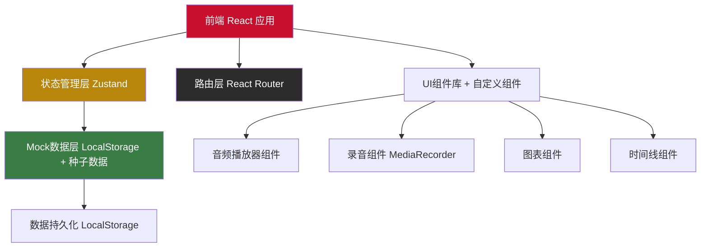
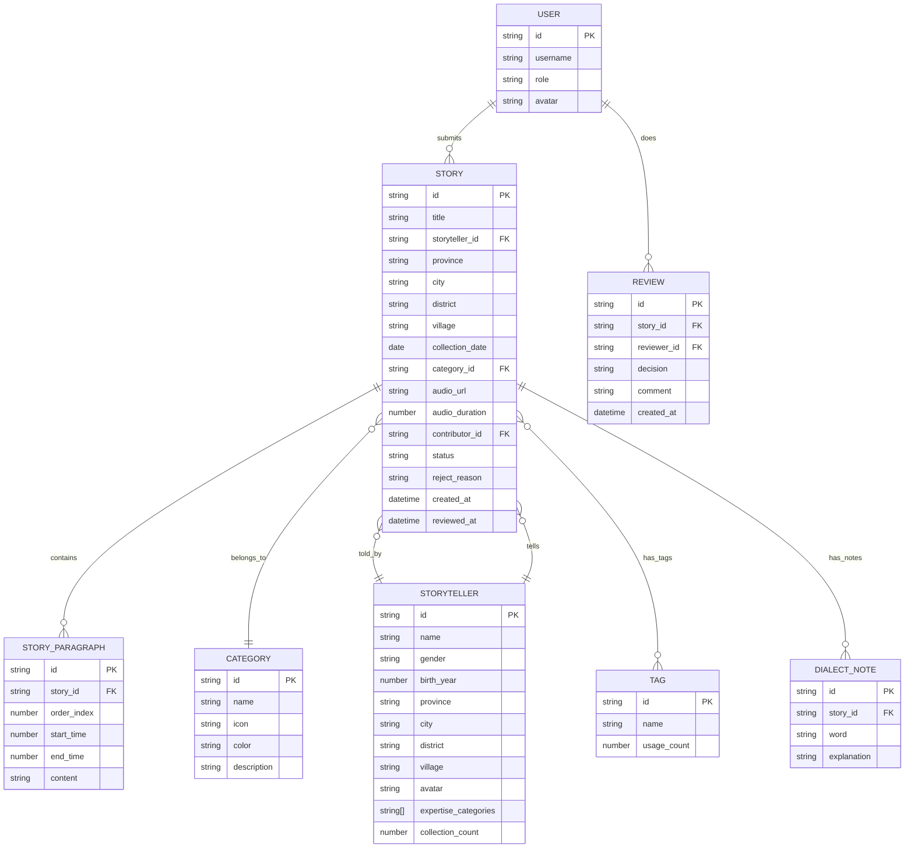

## 1. 架构设计



## 2. 技术选型

- **前端框架**: React@18 + TypeScript@5
- **构建工具**: Vite@5
- **样式方案**: TailwindCSS@3 + CSS Variables（自定义主题）
- **路由管理**: React Router DOM@6
- **状态管理**: Zustand@4（轻量，含持久化中间件）
- **图表库**: Recharts@2（分类饼图、趋势折线图、柱状图）
- **音频处理**: 原生 MediaRecorder API + Web Audio API
- **数据导出**: 原生 Blob/File API（JSON/CSV导出）
- **UI工具**: lucide-react（图标库）、clsx（类名合并）
- **无后端架构**: 全部数据通过 Mock 种子数据 + LocalStorage 持久化实现

## 3. 路由定义

| 路由 | 页面组件 | 用途 | 权限 |
|------|---------|------|------|
| / | HomePage | 首页：统计横幅+搜索筛选+分类卡片+时间线+排行榜 | 公开 |
| /story/:id | StoryDetailPage | 故事详情：音频播放+转录稿高亮+相关推荐 | 公开 |
| /storytellers | StorytellerListPage | 讲述者列表：筛选浏览 | 公开 |
| /storyteller/:id | StorytellerDetailPage | 讲述者详情：档案+故事时间线 | 公开 |
| /submit | SubmitStoryPage | 提交故事：表单+录音+转录稿编辑 | 贡献者 |
| /contributor/my-stories | MyStoriesPage | 我的提交：查看已提交故事状态 | 贡献者 |
| /admin/review | ReviewDashboardPage | 审核后台：待审核列表+审核操作 | 管理员 |
| /admin/manage/tags | TagManagePage | 标签管理：搜索+合并 | 管理员 |
| /admin/manage/storytellers | StorytellerManagePage | 讲述者管理：编辑+合并 | 管理员 |
| /admin/manage/categories | CategoryManagePage | 分类管理：增删改 | 管理员 |
| /admin/export | ExportDataPage | 数据导出：JSON/CSV+条件筛选 | 管理员 |
| /admin/stats | StatisticsPage | 统计看板：图表+排行榜 | 管理员 |

## 4. 数据模型

### 4.1 实体关系图



### 4.2 TypeScript 类型定义

```typescript
export type UserRole = 'visitor' | 'contributor' | 'admin';

export interface User {
  id: string;
  username: string;
  role: UserRole;
  avatar?: string;
}

export type StoryStatus = 'pending' | 'approved' | 'rejected';

export interface Category {
  id: string;
  name: string;
  icon: string;
  color: string;
  description: string;
}

export interface Tag {
  id: string;
  name: string;
  usageCount: number;
}

export interface Storyteller {
  id: string;
  name: string;
  gender: '男' | '女' | '未知';
  birthYear: number;
  province: string;
  city: string;
  district: string;
  village: string;
  avatar?: string;
  expertiseCategoryIds: string[];
  collectionCount: number;
}

export interface StoryParagraph {
  id: string;
  orderIndex: number;
  startTime: number;
  endTime: number;
  content: string;
}

export interface DialectNote {
  id: string;
  word: string;
  explanation: string;
}

export interface Story {
  id: string;
  title: string;
  storytellerId: string;
  province: string;
  city: string;
  district: string;
  village: string;
  collectionDate: string;
  categoryId: string;
  audioUrl?: string;
  audioDuration: number;
  contributorId: string;
  status: StoryStatus;
  rejectReason?: string;
  tagIds: string[];
  paragraphs: StoryParagraph[];
  dialectNotes: DialectNote[];
  createdAt: string;
  reviewedAt?: string;
}

export interface ReviewRecord {
  id: string;
  storyId: string;
  reviewerId: string;
  decision: 'approved' | 'rejected';
  comment?: string;
  createdAt: string;
}
```

### 4.3 Mock 种子数据分类

预置8个故事分类：
- 神话传说（神话、传奇、神怪故事）
- 历史人物（地方名人、历史传说人物）
- 地方风物（山川、名胜、地名由来）
- 民俗仪式（节庆、婚丧、祭祀习俗）
- 鬼怪故事（民间鬼故事、灵异传说）
- 民间歌谣（山歌、小调、童谣）
- 谚语谜语（歇后语、谜语、俗语）
- 手工技艺口述（匠人口述、技艺传承）

预置30+讲述者档案，50+已审核故事（每类5-8个），10+待审核故事，100+关键词标签。
