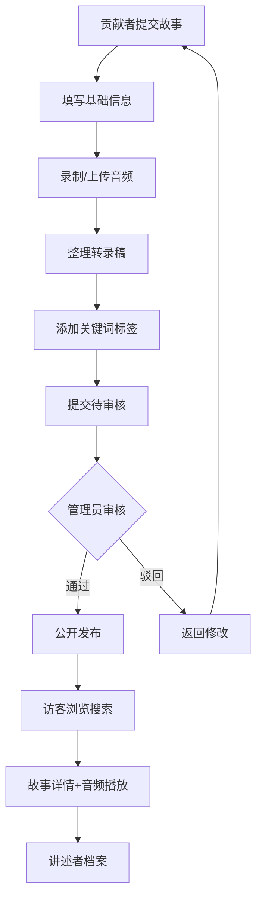

## 1. 产品概述

民间口述历史与地域传说数字化收集平台，致力于保护和传承中国非物质文化遗产中的口述文化资源。通过志愿者和社区成员的广泛参与，系统化采集、归档、审核并公开共享民间故事、神话传说、民俗仪式等口述资料。

- 解决问题：民间口述文化散佚流失、缺乏系统化归档、难以检索共享的现状
- 目标用户：文化志愿者、社区居民、民俗研究者、文化部门管理者、普通文化爱好者
- 产品价值：构建可持续的民间文化数字化保护生态，为学术研究和文化传承提供数据支撑

## 2. 核心功能

### 2.1 用户角色

| 角色 | 注册/登录方式 | 核心权限 |
|------|-------------|----------|
| 普通访客 | 无需登录 | 浏览已审核故事、搜索筛选、查看讲述者档案、查看统计数据 |
| 贡献者（志愿者/社区成员） | 模拟登录切换角色 | 提交故事（含音频录制/上传）、填写转录稿、管理个人提交 |
| 管理员 | 模拟登录切换角色 | 审核故事、编辑讲述者、管理分类标签、导出数据、查看后台统计 |

### 2.2 功能模块

1. **首页展示**：统计概览、故事时间线、分类展示、搜索筛选区域、贡献排行榜
2. **故事提交**：表单填写、浏览器录音/文件上传、转录稿编辑器、关键词标签
3. **故事详情**：音频播放器、同步高亮转录稿段落、讲述者信息、相关推荐
4. **讲述者档案**：个人信息、擅长类型、累计采集次数、故事列表时间线
5. **搜索筛选**：标题/讲述者/地点模糊搜索、省市区县三级筛选、分类筛选、标签筛选
6. **审核后台**：待审核列表、音频校对、通过/驳回、修改建议
7. **管理后台**：讲述者管理、标签合并、分类管理、数据导出（JSON/CSV）
8. **统计看板**：故事分类分布、采集年份趋势、地域覆盖统计、贡献排行榜

### 2.3 页面详情

| 页面名称 | 模块名称 | 功能描述 |
|---------|---------|---------|
| 首页 | 统计横幅 | 展示故事总数、讲述者人数、覆盖省份、覆盖村落数 |
| 首页 | 搜索筛选区 | 关键词搜索框、省市区县下拉选择、分类标签筛选 |
| 首页 | 分类展示卡片 | 8大故事分类图文卡片，点击进入筛选结果 |
| 首页 | 故事时间线 | 按采集日期倒序展示，支持无限滚动 |
| 首页 | 贡献排行榜 | Top10贡献者排名展示 |
| 故事提交页 | 基础信息表单 | 标题、讲述者、省市区县、采集日期、分类选择 |
| 故事提交页 | 音频录制区 | 浏览器MediaRecorder录音、时长显示、波形动画、文件上传备选 |
| 故事提交页 | 转录稿编辑器 | 分段输入、方言词汇附注区 |
| 故事提交页 | 关键词标签 | 输入框+已有标签建议、多标签管理 |
| 故事详情页 | 音频播放器 | 自定义播放控件、进度条、速度调节 |
| 故事详情页 | 转录稿展示 | 分段高亮当前播放段落、点击跳转播放、方言词汇弹窗 |
| 故事详情页 | 元信息区 | 分类标签、采集信息、讲述者卡片链接 |
| 讲述者列表页 | 筛选列表 | 按地区、擅长类型筛选 |
| 讲述者详情页 | 个人资料卡 | 头像、基本信息、擅长类型徽章、采集统计 |
| 讲述者详情页 | 故事时间线 | 该讲述者所有已发布故事列表 |
| 审核后台 | 待审核列表 | 卡片列表展示待审核故事概览 |
| 审核后台 | 审核详情 | 音频播放+转录稿对照、通过/驳回操作、修改建议填写 |
| 管理后台-标签 | 标签管理 | 标签列表、搜索、合并重复标签 |
| 管理后台-讲述者 | 讲述者管理 | 列表、编辑信息、合并重复讲述者 |
| 管理后台-分类 | 分类管理 | 分类增删改、图标设置 |
| 管理后台-导出 | 数据导出 | JSON/CSV格式选择、按条件筛选导出 |
| 统计看板 | 分类统计饼图 | 各分类故事数量占比 |
| 统计看板 | 年份趋势折线图 | 按采集年份统计故事增长 |
| 统计看板 | 地域分布图 | 省份数量柱状图 |
| 统计看板 | 贡献排行榜 | 详细排行榜表格 |

## 3. 核心流程

### 3.1 故事提交流程
贡献者登录 → 填写故事基础信息 → 上传音频文件或浏览器直接录制 → 整理文字转录稿并附注方言 → 添加关键词标签 → 提交进入待审核状态 → 等待管理员审核

### 3.2 审核流程
管理员登录 → 查看待审核列表 → 播放音频校对转录稿 → 通过/驳回（填写修改建议）→ 通过后故事公开发布

### 3.3 浏览搜索流程
访客访问首页 → 通过搜索框或筛选条件定位故事 → 点击进入详情页 → 播放音频并阅读转录稿 → 可跳转至讲述者档案查看更多

## 4. 用户界面设计

### 4.1 设计风格
- **主色调**：朱砂红（#C8102E）+ 宣纸米黄（#F5EFE0）+ 墨黑（#2C2C2C），体现传统文化底蕴
- **辅助色**：青绿（#3A7D44）、金色（#B8860B）点缀
- **按钮风格**：圆润边角（8-12px）、朱砂红主按钮、墨底描金次按钮，悬停有轻微上浮阴影
- **字体选择**：标题使用具有书法感的衬线字体（Noto Serif SC），正文使用清晰易读的思源黑体（Noto Sans SC）
- **布局风格**：卡片式布局、大量留白、中式对称与留白美学
- **视觉元素**：水纹底纹、祥云装饰边角、印章式标签、卷轴式时间线
- **图标风格**：线性中式风格图标，融入传统纹样元素

### 4.2 页面设计概览

| 页面名称 | 模块名称 | UI元素设计 |
|---------|---------|-----------|
| 首页 | 顶部导航栏 | 朱砂红底色+金色logo，导航项悬停下划线动画，角色切换按钮 |
| 首页 | 统计横幅 | 宣纸底纹背景，四个大数字卡片，数字有入场动画，朱砂红分割线 |
| 首页 | 搜索筛选区 | 宽大圆角搜索框带毛笔图标，省市区县三级联动下拉，标签云排列 |
| 首页 | 分类卡片 | 8张卡片呈2×4网格，各分类配手绘插图，hover翻转动效 |
| 首页 | 故事时间线 | 左侧卷轴式竖线，节点用印章图标，卡片错落排布 |
| 故事详情页 | 音频播放器 | 仿磁带/老唱片造型，播放按钮有旋转动效，波形可视化 |
| 故事详情页 | 转录稿 | 竖排/横排可选，当前段落朱砂红高亮，方言词下划线标注 |
| 讲述者详情 | 资料卡 | 圆形头像+金边，毛笔手写体姓名，擅长类型印章标签 |
| 管理后台 | 侧边导航 | 深色侧栏配金色图标，折叠展开动效 |

### 4.3 响应式设计
- **桌面优先**：1280px+ 多栏布局，充分展示内容
- **平板适配**：768-1279px 两栏布局，侧栏收窄，分类卡片2×4改为2×2
- **手机适配**：<768px 单栏堆叠，底部tab导航，时间线改为单列紧凑布局
- **触摸优化**：按钮最小44×44px，音频播放大按钮，列表项足够点击区域

### 4.4 动效设计
- **页面入场**：卷轴展开式动画，内容从上/左渐入
- **卡片hover**：轻微上浮3px + 金色光晕阴影
- **播放进度**：朱砂红进度条平滑增长，对应段落淡入高亮
- **录音波形**：实时柱状波形动画，频率随音量变化
- **时间线滚动**：元素依次淡入，印章节点有拓印效果
